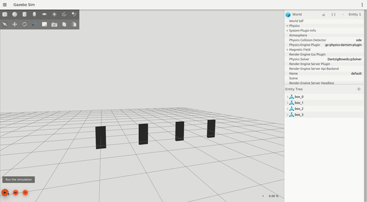
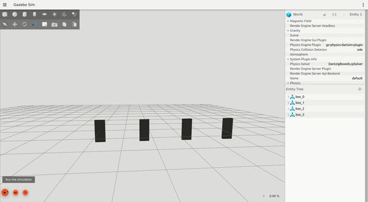

# simulation_benchmark
Benchmark comparison for rigid-body dynamic simulators. This project is part of GSoC'24@OpenRobotics. 

- [X] [Boxes benchmark: Free-floating rigid bodies:](https://github.com/yaswanth1701/simulation_benchmark/blob/gz-sim_dev/boxes_description.ipynb)

  
  
  
- [ ] [Triball benchmark: Rigid bodies in contact:]()

## Steps to run benchmark:
### Install dependencies:
```bash
pip install lz4 protobuf zstandard matplotlib numpy pandas
```
### Simulator requirement:
- #### Currently implemented simulator:
   - [X] Gazebo Ionic:
         Installation detail [here](https://gazebosim.org/docs/ionic/install_ubuntu_src/).
   
         ``` bash
  


This project is an effort to create an open-source benchmarking suite for robotics physics engines/simulators (for example: gazebo, mujoco, and drake). 

This suite offers the following features:
- Logging ([mcap](https://github.com/foxglove/mcap)/csv)
- Dynamics world generation at run-time (SDF format).
- Simulator independent post-processing script.

These features allow for a simulator-independent suite for benchmarking.

Currently implemented simulators/physics:

- 
